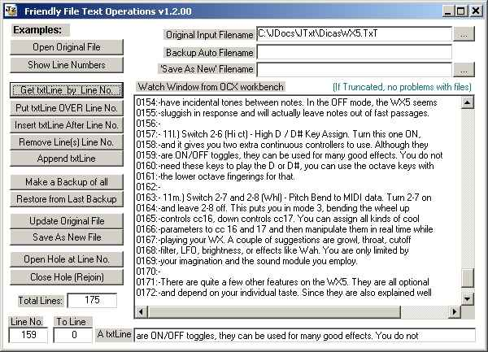



## Jz Friendly Text File Ops \(Final Enhanced 1\.2\)

### Description

Friendly OCX for Text Files I-O Operations! OpenFile, Getline, PutLine, InsertLine, AddLine, RemoveLine, Backup, Restore, Update, Save As, TotalLines, and unique Event for all Errors; No file size limits; No APIs; No Classes; its easy to treat as many files as need - merely drag one for each file. Two Projects: The Activex and a Sample EXE. v1.2.00:- All commands return T/F, new commands 'OpenHole' and 'CloseHole', functions Exists, BakExists and NewExists.
 
### More Info
 

             |
---                |---
**Submitted On**   |2006-03-04 12:07:48
**By**             |[JOZE Walter Moura](https://github.com/Planet-Source-Code/PSCIndex/blob/master/ByAuthor/joze-walter-moura.md)
**Level**          |Intermediate
**User Rating**    |5.0 (15 globes from 3 users)
**Compatibility**  |VB 6\.0
**Category**       |[Files/ File Controls/ Input/ Output](https://github.com/Planet-Source-Code/PSCIndex/blob/master/ByCategory/files-file-controls-input-output__1-3.md)
**World**          |[Visual Basic](https://github.com/Planet-Source-Code/PSCIndex/blob/master/ByWorld/visual-basic.md)
**Archive File**   |[Jz\_Friendl197781342006\.zip](https://github.com/Planet-Source-Code/joze-walter-moura-jz-friendly-text-file-ops-final-enhanced-1-2__1-64513/archive/master.zip)

